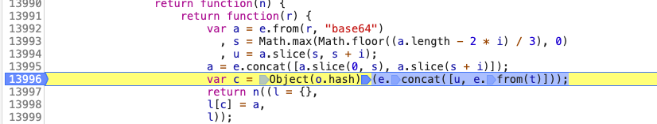
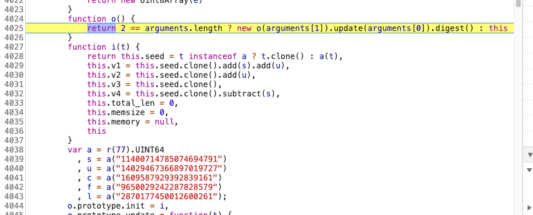
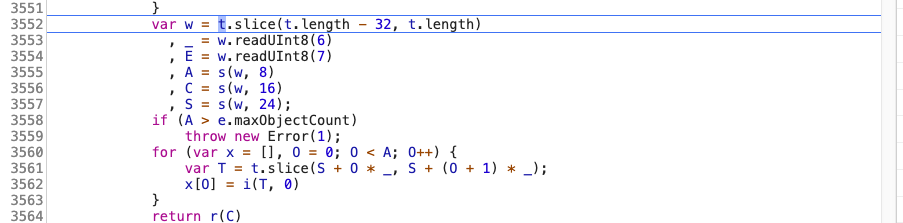
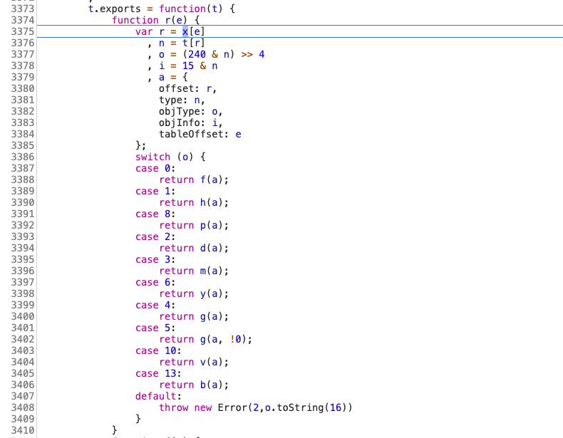

# 豆瓣读书

豆瓣搜索读书破解 如果对你有用给个star哦🌟

图书数据是直接加密的。加密就在window.__DATA__ 里面

window.__data__参数破解：💗base64 + xxHash + bplist💗

## base64 编码


13992 行，e.from(r, "base64") 很明显的提示 --> base解码过程

我们使用Python库 base64 进行验证
```python
import base64
base64.b64decode(window.__data__)
```

## xxHash
13996 行，Object(o.hash)  --> 肯定是一个hash 算法。我们下一步进入这个函数。

4025 行 update().digest() --> 用过Python hashlib库的人是不是感觉很熟悉

4039 - 4043 行 五个 magic constants   --> 进一步确认是xxhash 算法

```python
import xxhash
# u 是base64 解密之后的最后16个字节
sec_key = xxhash.xxh64_hexdigest(u, 41405).encode("utf-8")
```


xxHash 是一种非常快速的非加密哈希算法。使用[教程](https://pypi.org/project/xxhash/)

## bplist破解 
我们继续向下执行代码，这里初步怀疑是bplist 解析过程（为什么我会知道，后面会介绍[bplist](#bplist)的知识）



我们继续调试



看到这。不用怀疑这就是pblist解析过程。但是我们观察[bplist 对象表](#objType)会发现：豆瓣改变了objType= 4,5,6的解析方式。

豆瓣bplist

| objType     |   hex    | 
| :---------: | :------: |
| 二进制       | 0x6X     | 
| 字符串ASCII  | 0x4X     |     
| 字符串UTF-16 | 0x5X     | 

具体解析过程请看源码。

<span id = "bplist"></span>
## Binary Plist解析详解

- bplist文件由四个部分组成：文件头，对象表，偏移表， 文件尾

### Handle trailer, last 32 bytes of the file (文件最后32个字节)            
                                                          
| filed                 | length | meaning             |    
| :-------------------: | :-----:| :-----------------: |    
| null                  | 6      | 备用                 |     
| offset_size           | 1      | 偏移表中的整形字节长度   |          
| object_ref_size       | 1      | 对象表中的整形字节长度   |          
| num_objects           | 8      | 偏移表中的元素个数      |         
| top_object            | 8      | 根节点中的起始位置      |         
| offset_table_offset   | 8      | 偏移表在文件中的起始位置 |           


### 偏移表

- 文件从offset_table_offset开始的 offset_size * num_objects个字节

<span id = "objType"></span>
### 对象表

| objType    |   (hex） | 说明 |
| :--------: | :------: | :------------------------------------------------------------------------------------ |
|单字节| 0x0X | X=0: 返回 null <br> X=8: false <br>X=9: true <br> X=F: b"", 填充字节 |
|整数 | 0x1X | 后面跟的2^X个字节就是这个数字的值 |
|浮点型 | 0x2X | X=2: float类型数据（4位） <br> X=3: double类型数据（8位）|
|日期 | 0x33 | 后面接着8个字节的浮点数时间戳 |
|二进制 | 0x4X | X表示这段数据的字节数，如果X=F，则取后面一个字节的记为Y，随后的2^Y个字节解析为整数Z，即为这段数据的字节数 |
|字符串 | 0x5X | ASCII编码 X表示这段数据的字节数,如果X=F则后面作为整数对象继续解析所得数既为字节数 |
|字符串 | 0x6X | UTF-16 X表示这段数据的字节数,如果X=F则后面作为整数对象继续解析所得数既为字节数 记得双字节! |
|数组 | 0xAX | X表示其元素个数,如果X=F则后面作为整数对象继续解析所得数既为个数 后面接着X个元素在偏移表的位置 |
|字典 | 0xDX | X表示其元素个数,如果X=F则后面作为整数对象继续解析所得数既为个数 后面接着X个key在偏移表的位置,X个value在偏移表的位置 |

[javascript pblist parse无混淆代码](http://mail-archives.apache.org/mod_mbox/cordova-commits/201706.mbox/%3C22496a5587524ec985891ee5fe5e1219@git.apache.org%3E)
